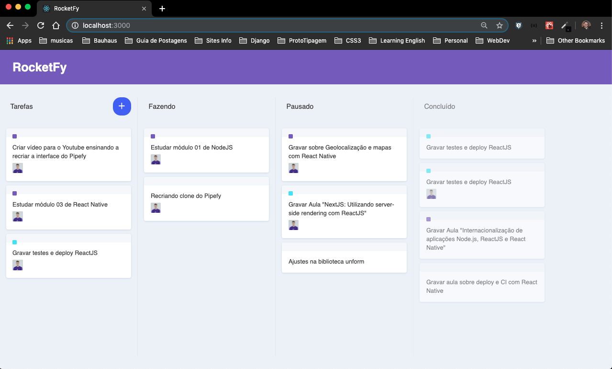

## RocketFy

App criado seguindo o video da RocketSeat.

# Link Youtube
https://www.youtube.com/watch?v=awRtgpRsdTQ&t=3669s

# Link do github:
https://github.com/Rocketseat/youtube-ui-clone-pipefy

A idéia dessa aplicação é replicar o comportamento do Piperfy.

É uma ferramenta com de lista de tarefas.

# Demo1



## Para usar

Instalar dependências
```sh
yarn
```
Rodar o projeto
```sh
yarn start
```
URL
```sh
http://localhost:3000/
```